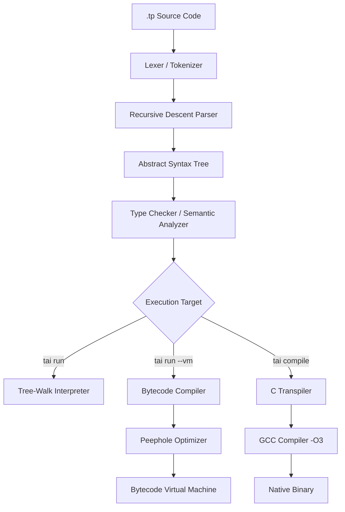

# Taipan — The AI-Native Programming Language

[](https://www.python.org/downloads/)
[](https://opensource.org/licenses/MIT)
[]()
[]()

> **Taipan** is a modern, statically typed, and expressive programming language designed from the ground up to be fully AI-native. It blends the ergonomics of Python, the speed and efficiency of native C compilation, and direct LLM capabilities natively baked into the language runtime and tooling.

```
       _____      _
      |_   _|    (_)                
        | |  __ _ _ _ __   __ _ _ __  
        | | / _` | | '_ \ / _` | '_ \ 
        | || (_| | | |_) | (_| | | | |
        \_/ \__,_|_| .__/ \__,_|_| |_|
                   | |                
                   |_|                
```

---

## 1. Project Overview & Features

Taipan represents a paradigm shift where AI assistance is not just an editor plugin, but a core component of the language architecture itself. Whether interpreting scripts locally, executing bytecode on a high-performance virtual machine, or compiling to native C code, Taipan integrates LLM context directly.

### 🧠 AI-Native Design
- **Built-in AI Assistant Declarations**: Declare AI entities using the `ai` keyword.
- **Contextual Error Explanations**: Enable `TAIPAN_AI_ERRORS=1` to get detailed, colored CLI suggestions from OpenAI or local LLMs on errors, complete with an in-memory 128-entry LRU cache to keep repeat requests instant and free.
- **Local LLM First**: Seamlessly routes requests to a local Ollama instance (defaulting to `llama3.2` on `localhost`) before falling back to OpenAI or offline mocks.
- **Built-in AI Standard Library**: Classify sentiment, summarize documents, translate languages, and generate code natively using simple library functions.

### 🏗 Modern Language Syntax
- **Gradual Type System**: Optional but powerful type annotations (`Int`, `Float`, `String`, `Bool`, `List`, `Map`, `Func`).
- **Flexible Execution Backends**: 
  1. A fast **Tree-Walk Interpreter** for rapid development and interop.
  2. An optimized **Bytecode VM** featuring peephole optimization, dead code elimination, and inline caching.
  3. An **AOT C Transpiler** compiling directly to native machine code via GCC.
- **OOP with Inheritance**: Classes supporting initializers, field shadowing, method overrides, and `extends`/`super` semantics.
- **First-class Concurrency**: High-level task dispatch using `spawn` and `wait`.
- **First-class Python Interop**: Seamlessly import any Python module directly into your Taipan script.
- **Professional Diagnostic Tooling**: Rust-style error spans indicating the exact file, line, column, and range.

---

## 2. Tech Stack

- **Core Engine & Compiler**: Python 3.10+ (using `setuptools` and `tomllib`).
- **Language Lexer & Parser**: Custom-written regex lexer and recursive descent parser.
- **Virtual Machine**: Bytecode engine with inline caching and constant folding.
- **Native Transpiler**: C99 Code Generator compiled using `GCC` (`-O3`).
- **IDE Support**: JSON-RPC Language Server Protocol (LSP) Server and custom VS Code extension.
- **Package Management**: Integrated package manager (`tpkg`) running on standard TOML manifests.

---

## 3. Prerequisites

Before installing Taipan, ensure you have the following installed:

- **Python**: Version `3.10` or higher.
- **GCC**: Required for building native binaries via `tai compile`. Make sure `gcc` is on your system path.
- **Ollama** (Optional for local AI): Download and run [Ollama](https://ollama.com) locally.
- **OpenAI API Key** (Optional for cloud AI): Set your `OPENAI_API_KEY` environment variable.

---

## 4. Getting Started

### 1. Clone the Repository
```bash
git clone https://github.com/peeyush/taipan.git
cd taipan
```

### 2. Install in Development Mode
To install the `tai`, `tpkg`, and `taipan-lsp` commands globally, run:
```bash
pip install -e .
```

### 3. Verify the Installation
Run the help command to check that the CLI works:
```bash
tai help
```

### 4. Create and Run Hello World
Create a file named `hello.tp`:
```tp
// hello.tp
let name: String = "Peeyush"
let age = 19
show(f"Hello, {name}! You are {age} years old.")
```

Run it using the interpreter:
```bash
tai run hello.tp
```

Or run it using the Bytecode VM backend:
```bash
tai run hello.tp --vm
```

Or compile it to a native standalone executable:
```bash
tai compile hello.tp -o hello.exe
./hello.exe
```

---

## 5. Architecture Overview

Taipan's multi-tier execution pipeline gives developers maximum flexibility:



### Compilation & Optimization Pipeline

1. **Semantic Type Checker**: Per-node verification that enforces type safety. Supports type widening (e.g., `Int` to `Float`) and prevents unsafe operations.
2. **Bytecode Compiler**: Generates custom virtual machine instructions.
   - **Constant Folding**: adjacent binary operations on constants (e.g. `1 + 2 * 3`) are computed at compile time.
   - **Dead Code Elimination**: Code unreachable after `return` or unconditional branch blocks is pruned.
   - **NOP Elimination**: Strips layout artifacts and patches jumps.
3. **Bytecode VM**: Stack-based execution with:
   - **Inline Caching**: Speeding up property lookups on class instances.
   - **Disassembly**: Color-coded view of VM structures using `tai disasm`.
4. **C Transpiler**: Maps the AST structure to performance-critical C code, producing optimized binaries that bypass interpreter overhead.

---

## 6. Environment Variables

Configure Taipan's AI and debug features using these environment variables:

| Variable | Description | Default |
|----------|-------------|---------|
| `TAIPAN_AI_ERRORS` | Set to `1` to always get AI error explanations on execution failures. | `0` |
| `OPENAI_API_KEY` | Your API key for cloud-based AI completions. | None |
| `OLLAMA_HOST` | Host URL for local Ollama service. | `http://localhost:11434` |
| `OLLAMA_MODEL` | The LLM used by Ollama. | `llama3.2` |
| `TAIPAN_DEBUG` | Enables developer logs and displays full Python stack traces on crash. | `0` |

---

## 7. Available CLI Commands

Taipan comes with a complete suite of developer commands.

### `tai` CLI Reference

| Command | Arguments | Flags | Description |
|---------|-----------|-------|-------------|
| `run` | `<file.tp>` | `--vm`, `--ai` | Run a program using interpreter or VM. Enable AI helper. |
| `compile` | `<file.tp>` | `-o <out>` | Compile program to a native native executable. |
| `repl` | — | `--vm`, `--ai` | Open the interactive read-eval-print loop. |
| `check` | `<file.tp>` | — | Run type-checker and semantic analyzer only. |
| `format` | `<file.tp>` | — | Auto-format a source file (spaces, indentation). |
| `test` | `[file\|dir]` | — | Discover and run test blocks (recursively in directories). |
| `disasm` | `<file.tp>` | — | Print optimized bytecode disassembly with color coding. |
| `bench` | `[quick]` | — | Execute internal VM and runtime benchmarks. |
| `doc` | `<file.tp>` | `-o <out>` | Generate markdown reference docs from functions. |
| `tokens` | `<file.tp>` | — | Print list of tokens output by lexer. |
| `ast` | `<file.tp>` | — | Pretty-print the parsed Abstract Syntax Tree. |
| `init` | `[name]` | — | Scaffold a new package directory with `taipan.toml`. |
| `build` | — | — | Verify package imports and check project structure. |

### Examples

```bash
# Get AI assistance in the REPL
tai repl --ai

# Perform full benchmarking
tai bench

# Disassemble a file to review constant folding
tai disasm examples/fibonacci.tp
```

---

## 8. Language Tour

### Variables & Types
Variables are declared using `let` (mutable) or `const` (immutable). Type annotations are optional.
```tp
let count = 42                 // Inferred as Int
const pi: Float = 3.14159      // Statically typed Float
let label: String = "Taipan"
let active: Bool = true
let values: List = [1, 2, 3]
let config: Map = {"port": 8080}
```

### Control Flow
```tp
// Conditionals
if count > 50 {
    show("Greater")
} else {
    show("Smaller")
}

// Ranges
for i in 1..5 {
    show(i) // Prints 1, 2, 3, 4, 5
}

// Repeat loop (fast iteration)
repeat 3 {
    show("Looping!")
}

// Standard while loop
while count > 40 {
    count -= 1
}
```

### Functions
Functions are declared using `func` and support parameter type hints, default values, and return type assertions.
```tp
func multiply(x: Int, y: Int = 2) -> Int {
    return x * y
}

// Higher-order function usage
func apply(val: Int, operation: Func) -> Int {
    return operation(val)
}

let double = func(n) { return n * 2 }
show(apply(10, double)) // Prints 20
```

### Object-Oriented Programming (OOP)
Taipan implements a complete class-based object system.
```tp
class Device {
    func init(name: String) {
        self.name = name
    }
    func status() -> String {
        return f"{self.name} is online."
    }
}

class Smartphone extends Device {
    func init(name: String, model: String) {
        super.init(name)
        self.model = model
    }
    func status() -> String {
        return f"{self.name} ({self.model}) is connected."
    }
}

let phone = new Smartphone("MyPhone", "TP-100")
show(phone.status())
```

### First-class Concurrency
Spawn light threads and await their termination.
```tp
func calculate(id) {
    time.sleep(1.0)
    show(f"Task {id} complete")
}

spawn calculate(1)
spawn calculate(2)
wait
show("All tasks finished!")
```

### Python Interop
Import native Python libraries inside your Taipan script.
```tp
import python "math" as pymath
import python "time" as pytime

show(pymath.sin(pymath.pi / 2))
```

### Built-in Error Handling
```tp
try {
    let bad = 10 / 0
} catch (error) {
    show(f"Recovered from error: {error}")
}

// Catch expressions for single-line safety
let value = catch { 10 / 0 }
if value != null {
    show("Operation failed.")
}
```

---

## 9. AI-Native Programming Guide

Taipan integrates LLM calls directly into the grammar and execution engine.

### AI Keyword & Assistants
Declare isolated AI assistant objects that retain context:
```tp
ai codeBuddy

let explanation = codeBuddy.ask("Explain recursion in 1 sentence.")
show(explanation)
```

### The Standard `ai` Library
```tp
import ai

// Check if a backend (Ollama or OpenAI) is connected
if ai.isAvailable() {
    // 1. Text Summarization
    let summary = ai.summarize("A long paragraph of text explaining neural network architectures...")
    
    // 2. Code Generation
    let code = ai.generateCode("a python function to sort a list of objects by 'age'")
    
    // 3. Sentiment Classification
    let score = ai.sentiment("This is a fantastic programming language!") // "Positive"
    
    // 4. Translation
    let spanish = ai.translate("Hello world", "Spanish")
}
```

---

## 10. Standard Library

| Module | Core Classes | Key Functions |
|--------|--------------|---------------|
| **`math`** | — | `sqrt`, `pow`, `abs`, `floor`, `ceil`, `round`, `log`, `log2`, `log10`, `sin`, `cos`, `tan`, `factorial`, `gcd`, `lcm`, `isnan`, `isinf`, `hypot`, `clamp`, `lerp`, `random`, `randint`, constants (`pi`, `e`, `tau`, `inf`) |
| **`string`** | — | `upper`, `lower`, `split`, `join`, `replace`, `strip`, `startsWith`, `endsWith`, `contains`, `substring`, `regexMatch` |
| **`file`** | — | `read`, `write`, `append`, `lines`, `delete`, `exists`, `listDir`, `mkdir` |
| **`json`** | — | `parse`, `stringify`, `load`, `save` |
| **`time`** | — | `now`, `timestamp`, `sleep`, `year`, `month`, `day`, `hour`, `minute`, `second` |
| **`network`** | — | `get`, `post`, `put`, `delete`, `head`, `patch` |
| **`collections`**| `Stack`, `Queue`, `PriorityQueue` | `counter`, `flatten`, `unique`, `zip`, `enumerate`, `chunk` |
| **`ai`** | — | `ask`, `summarize`, `generateCode`, `classify`, `translate`, `sentiment`, `isAvailable`, `setModel`, `getModel` |

---

## 11. Package Manager (`tpkg`)

Taipan packages are defined using `taipan.toml` configuration manifests.

### The `taipan.toml` Manifest
```toml
[package]
name = "my-helper"
version = "1.0.0"
description = "A utility package"
author = "Your Name"
license = "MIT"

[dependencies]
# List package dependency names and versions
# math_utils = "1.0.0"
```

### Commands Reference

```bash
# Initialize a new package project structure
tpkg init my_package

# Install package dependencies from the registry
tpkg install http_client

# Uninstall an installed package
tpkg uninstall http_client

# List all local packages currently installed
tpkg list

# Search the registry for packages matching a name
tpkg search db

# Publish your completed package to the local registry
tpkg publish

# Build/verify the package syntax
tpkg build
```

---

## 12. Testing

Write test blocks directly inside your source files or under a `tests/` directory:

```tp
// math_tests.tp
func add(a, b) { return a + b }

test "addition works" {
    assert(add(2, 3) == 5)
}

test "addition fails on bad math" {
    assert(add(2, 2) == 5) // Will fail
}
```

Run tests using the CLI test runner:
```bash
# Run tests in a specific file
tai test math_tests.tp

# Run all test blocks in a directory recursively
tai test tests/
```

To run the compiler test suite (Pytest):
```bash
python -m pytest
```

---

## 13. VS Code & Language Server (LSP)

The `taipan-lsp` server offers complete Language Server Protocol (LSP) integration.

### LSP Features
- **Diagnostics**: Real-time syntax and type warnings.
- **Auto-completion**: Keywords, variables, and stdlib functions.
- **Hover Docs**: Detailed tooltips showing function signatures.
- **Go to Definition**: Navigate directly to variable or class declarations.
- **Symbol Outline**: Code navigation tree.

### Visual Studio Code Setup
1. Copy the `vscode_extension` folder to your VS Code extensions folder:
   ```bash
   cp -r vscode_extension ~/.vscode/extensions/taipan-1.0.0/
   ```
2. Navigate to the extension directory and install dependencies:
   ```bash
   cd ~/.vscode/extensions/taipan-1.0.0/
   npm install
   ```
3. Reload Visual Studio Code. The extension will automatically start the `taipan-lsp` process for `.tp` files.

---

## 14. Roadmap

See [ROADMAP_AI_ECOSYSTEM_PERF.md](ROADMAP_AI_ECOSYSTEM_PERF.md) for full sprint details.
- [x] Tree-walk interpreter and AST parser.
- [x] Bytecode VM with Peephole Optimizer (Constant folding, NOP elimination).
- [x] Inline caching for class member lookups.
- [x] AI keyword and standard `ai` module.
- [x] Contextual AI error diagnostics with LRU Cache.
- [x] Standalone compiler (`tai compile`) via C transpilation.
- [x] Custom package manager (`tpkg`) and CLI suite.
- [x] LSP server and VS Code syntax extension.
- [ ] **Sprint 1**: Type Inference engine.
- [ ] **Sprint 2**: Async / Await runtime loop.
- [ ] **Sprint 3**: LLM-guided JIT compilation optimization.

---

## 15. Contributing & License

Please refer to [CONTRIBUTING.md](CONTRIBUTING.md) for local development guidelines.

Distributed under the **MIT License**. See [LICENSE](LICENSE) for more information.

---

*Built with ❤ by Peeyush*
